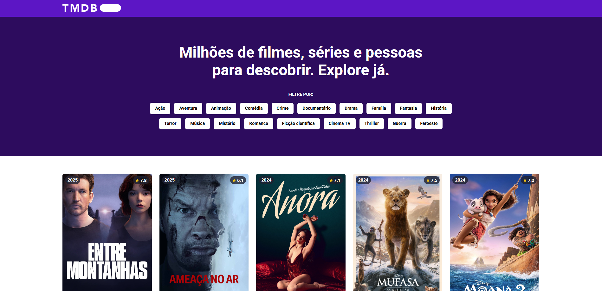

# Projeto: TMDB (The Movie Database)

## Descrição do Projeto

Este é um aplicativo que utiliza a API do TMDB (The Movie Database) para exibir informações sobre filmes, incluindo detalhes como título, sinopse, elenco e avaliações. O projeto foi desenvolvido para explorar a integração com APIs REST e criar uma interface interativa para os usuários.

## Funcionalidades

<ul>
  <li>Listagem de filmes populares</li>
  <li>Pesquisa de filmes por categoria</li>
  <li>Exibição de detalhes de um filme</li>
  <li>Avaliação dos filmes</li>
  <li>Reprodução de trailers (se disponível)</li>
</ul>

## Foram utilizadas as seguintes tecnologias:

<ul>
  <li>React</li>
  <li>React Router</li>
  <li>API: TMDB API</li>
  <li>CustomHooks (useFetch)</li>
  <li>useState</li>
  <li>Framer Motion</li>
  <li>Estilização: Tailwind CSS</li>
</ul>

 
Deploy: <a href="" target="_blank">Clique aqui</a> 
